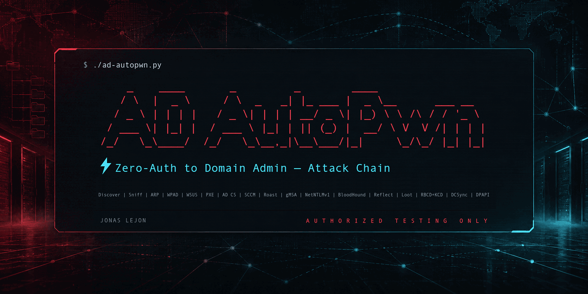

# AD AutoPwn


**Zero-Auth to Domain Admin — Automated Active Directory Attack Chain**

A fully automated penetration testing tool that chains 25+ attack
techniques to compromise Active Directory environments. Designed for
authorized security assessments.



[Usage](#usage) · [Phases](#available-phases) · [Arguments](#command-line-reference) ·
[Dependencies & installation](#dependencies) · [Companion tools](#companion-tools) ·
[Runtime & output](#runtime-behavior-and-output) · [Testing](#tested-against)

## Features

### Pre-auth username & credential discovery (zero creds)

- **kerbrute** KRB-AS-REQ user enumeration (lockout-safe)
- **CLDAP NetLogon ping** username enumeration (lockout-safe)
- **AS-REP roast** of all candidates (free hashes for accounts with `DONT_REQ_PREAUTH`)
- **Anonymous LDAP bind / Root DSE checks**
- **pre2k auto-test** (Windows 2000 compatibility default-password machines)
- **Blank-password and username-as-password checks** — enabled by default;
  disable with `--no-weak-pw` (up to two authentication attempts per user)
- **Single-password spray** — opt-in via `--spray-password`; one password per user

### Layer-2 / passive zero-auth attacks

- **Passive network sniffing** — WPAD, WSUS, PXE, LLMNR, DHCPv6, TFTP, SCCM ProxyDHCP detection
- **ARP spoof + NTLM relay** — capture and crack NTLMv2 hashes
- **WPAD poisoning** — mitm6 / Responder IPv6 DNS hijack
- **WSUS relay** — intercept Windows Update NTLM auth (port 8530/8531)
- **PXE boot credential theft** — extract creds from boot images via TFTP/WIM
- **NTLM theft file drops** — `.library-ms` / `.theme` / `.url` files on writable shares
- **WebDAV coercion** — WebClient HTTP → LDAP relay (bypasses SMB signing)
- **DHCP coercion** — DHCP server machine account relay

### Authentication-reflection bypass (Synacktiv 2026)

- **CVE-2025-58726 ghost-SPN** Kerberos AP-REQ reflection (auto-fired by BloodHound auto-action)
- **CVE-2026-24294 LPE** — SMB-on-arbitrary-tcpport reflection (Win11 24H2 / Server 2025 pre-March-2026)
- **CVE-2026-26128 LPE** — Kerberos loopback via Unicode SPN
- **Unicode-SPN fallback** when CVE-2025-33073 path is patched

### Credential harvesting (post-auth)

- **Kerberoasting** — extract and auto-crack SPN hashes (hashcat mode 13100/19700)
- **AS-REP Roasting** — crack accounts without pre-auth (hashcat mode 18200)
- **Timeroast** — SNTP-MS hashes from any domain-joined machine (hashcat mode 31300)
- **gMSA managed-password read** — `nxc ldap --gmsa` in the enrichment battery turns
  a readable Group Managed Service Account's `msDS-ManagedPassword` blob directly
  into a pass-the-hash-able NT hash; `ReadGMSAPassword` ACEs are auto-fired as a
  BloodHound auto-action edge
- **LAPS password recovery** + **userPassword LDAP attribute** + **description-leaked passwords** (mined from nxc enrichment battery)
- **GPP cpassword recovery** — NetExec `gpp_password` results are parsed into
  `enrich-gpp.txt`
- **SCCM NAA theft** — extract Network Access Account credentials via sccmhunter
- **NetNTLMv1 downgrade → machine NT hash** — coerce a host to a static-challenge
  Responder (ESS disabled), capture the NetNTLMv1 response, recover the machine
  account's NT hash via crack.sh's DES keyspace. Signing-independent (works where
  the NTLMv2 relay can't): DC$ → straight DCSync; member$ → S4U2Self self-takeover
  → local admin

### Graph-driven attack chains (BloodHound)

- **`bloodhound-python -c All`** collection + ZIP analysis
- **High-value findings** — Domain/Enterprise/Schema Admins, Kerberoastable, AS-REP roastable, unconstrained delegation, RBCD inbound, LAPS, AdminCount
- **Actionable-edge analysis** — controlled-principal closure (you + transitive group memberships) → ACE edges where you are the principal: `WriteSPN`, `AddKeyCredentialLink`, `GenericAll/Write`, `WriteDacl/Owner`, `WriteAccountRestrictions`, `AddAllowedToAct`, `ForceChangePassword`
- **AdminTo extraction** — computers where a principal you control sits in the
  local Administrators group; written to `admin-to-hosts.txt` and fed straight
  into the loot phase as SAM/LSA dump targets
- **Auto-action chain** — automatically fires matching primitives:
  - `WriteSPN → ghost-SPN upgrade` (CVE-2025-58726)
  - `AddKeyCredentialLink → shadow credentials → PKINIT → NT hash`
  - `ReadGMSAPassword → gMSA managed-password read → NT hash`
  - `GenericAll / GenericWrite / WriteAccountRestrictions / AddAllowedToAct on Computer → RBCD`
  - `ForceChangePassword / AllExtendedRights on User → password reset`
  - `GenericAll / GenericWrite on User → shadow credentials, then logon-script fallback`
  - `GenericAll / GenericWrite on Group → add self to group`
  - `WriteDacl / WriteOwner / Owns → GenericAll grant → takeover by object type`
- **Access-surface enumeration** — RDP, WinRM, Guest SMB sessions, and share
  permissions, saved to `access-*.txt` by `enum`

### Privilege escalation primitives

- **AD CS exploitation** — ESC1-ESC16 via certipy (auto-enum + exploit)
  - ESC8 (web-enrollment relay)
  - ESC9/ESC10 UPN-swap (CVE-2022-26923 bypass)
  - ESC4 template modify+exploit+restore (cwd-safe)
  - **ESC1-CMC** — KB5014754 bypass via CMC `id-cmc-addExtensions` (bundled
    `cmc_addext.py`). When a patched CA issues an ESC1 cert but PKINIT binds to
    the requester, ad-autopwn falls back to forging an Administrator cert with a
    **matching `szOID_NTDS_CA_SECURITY_EXT` SID** — so PKINIT wins even at
    `StrongCertificateBindingEnforcement=2`. The only path here that beats full
    enforcement, and (unlike ESC9/ESC10) needs no controllable victim account.
  - Certihound enumeration with certipy fallback (NT-hash auth)
- **Shadow Credentials** — msDS-KeyCredentialLink via ntlmrelayx or pywhisker
- **RBCD abuse** — Resource-Based Constrained Delegation (addcomputer + S4U2Self + S4U2Proxy)
- **RBCD+KCD chain orchestrator** — full WriteSPN → ghost-SPN → RBCD → S4U2Proxy → `-altservice` rewrite, in one phase
- **TGS sname rewrite** (tgssub-style KCD protocol-transition bypass) — standalone or inline via `-altservice`
- **Dollar Ticket** — KDC's automatic `$`-suffix retry on principal lookup → TGT for Linux user via auto-created `<user>$` machine account → GSSAPI SSH
- **GPO abuse** — pyGPOAbuse scheduled task as SYSTEM

### Domain compromise

- **DCSync** — full domain hash dump via impacket-secretsdump
- **DPAPI backup key** — extract domain DPAPI key for offline credential decryption
- **AppLocker bypass** — LOLBins (mshta, certutil, regsvr32, etc.) + WSUS signed delivery
- **WSUS update injection** — push malicious Windows Updates via wsuks

### Post-exploitation loot

- **Local SAM / LSA / LSASS dump** — on every host where you hold local admin
  (compromised, AdminTo, or PtH-reuse hosts), run `nxc --sam --lsa` (+ optional
  `lsassy`) to harvest local NT hashes, cached domain creds (`$DCC2$`), service
  account secrets and DPAPI keys. Turns one foothold into many.
- **Pass-the-hash reuse sweep** — takes each harvested local `Administrator` NT
  hash and sprays it `--local-auth` across the subnet to find hosts sharing the
  local password; newly-pwned hosts feed back into the loot loop
- **Process command-line harvest** — `Get-CimInstance Win32_Process` via `nxc -x`; regex-greps for passwords in mysql/sqlcmd/runas/KeePass/`--password` style flags
- **KeePass vault discovery + crack** — find `*.kdbx` in `C:\Users`, download via smbclient, `keepass2john | hashcat -m 13400`

## Usage

Every live run displays a production-use warning and requires interactive
confirmation that you have written permission and an agreed scope. Approved
non-interactive automation can bypass the prompt with `--acknowledge-risk`.
The warning is still displayed.

Use **Linux with Python 3.10+**. Live `full` (the default), `arp`, `wpad`,
`wsus`, and `sniff` runs require root, including `full` with credentials or
`--no-arp --no-wpad`. Other phases can also need root when they start listeners,
use raw sockets, or mount images. See [Dependencies](#dependencies) for setup.

`python3 ad-autopwn.py --help` lists options and exits before discovery or the
warning. The installed command is `ad-autopwn`; examples below run from this
checkout.

```bash
# Fully automated — zero-cred chain (prompts for authorization)
sudo ./ad-autopwn.py

# Approved non-interactive/lab automation
sudo ./ad-autopwn.py --acknowledge-risk

# With credentials — full chain
sudo ./ad-autopwn.py -u jsmith -p 'P@ss123' -d corp.local --dc-ip 10.0.0.1

# AWS / VPC labs (Layer 2 attacks blocked) — auto-discovery still works
sudo ./ad-autopwn.py --no-arp --no-wpad

# Pre-auth discovery, with blank / username-as-password checks disabled
./ad-autopwn.py --phase discover --no-weak-pw -d corp.local --dc-ip 10.0.0.1

# BloodHound graph collection + automatic high-value analysis
./ad-autopwn.py --phase bloodhound -u user -p pass -d corp.local \
                --dc-ip 10.0.0.1 --dc-fqdn dc01.corp.local

# Dollar Ticket — TGT for 'root' via auto-created root$ machine acct
./ad-autopwn.py -u user -p pass -d corp.local --dc-ip 10.0.0.1 \
                --phase dollar-ticket --target-user root

# RBCD+KCD chain — full ghost-SPN + RBCD + altservice rewrite, one shot
./ad-autopwn.py -u user -p pass -d corp.local --dc-ip 10.0.0.1 \
                --phase rbcd-kcd -T 'VHAGAR$' --alt-spn HTTP/vhagar.corp.local

# gMSA managed-password read → NT hash
./ad-autopwn.py -u user -p pass -d corp.local --dc-ip 10.0.0.1 \
                --phase gmsa -T 'svc_gmsa$'

# NetNTLMv1 downgrade — coerce the DC, capture NetNTLMv1, format for crack.sh
sudo ./ad-autopwn.py -u user -p pass -d corp.local --dc-ip 10.0.0.1 \
                -a 10.0.0.50 -i eth0 --phase ntlmv1 -T 10.0.0.1

# NetNTLMv1 fast-path — chain a crack.sh-recovered DC hash straight to DCSync
./ad-autopwn.py -u user -p pass -d corp.local --dc-ip 10.0.0.1 \
                --dc-fqdn dc01.corp.local --phase ntlmv1 \
                --ntlmv1-nthash 'DC01$:0123456789abcdef0123456789abcdef'

# Loot — local SAM/LSA/LSASS dump + pass-the-hash reuse sweep
./ad-autopwn.py -u user -p pass -d corp.local --dc-ip 10.0.0.1 \
                -t 10.0.0.0/24 --phase loot

# AppLocker bypass
sudo ./ad-autopwn.py -u user -p pass --applocker --lolbin mshta --custom-cmd "whoami"

# Preview attack commands (startup discovery may still probe the network)
./ad-autopwn.py --dry-run -u user -p pass -d corp.local --dc-ip 10.0.0.1
```

## Available phases

| Phase             | Auth   | Description |
|-------------------|--------|-------------|
| `full`            | optional | Complete automated chain (auto-detects with or without creds) |
| `sniff`           | none   | Passive L2 traffic discovery |
| `discover`        | none   | Anonymous LDAP + kerbrute + CLDAP + AS-REP + pre2k + weak-password checks + opt-in spray |
| `arp`             | none   | ARP spoof + NTLM capture |
| `wpad`            | none   | WPAD/LLMNR poisoning (mitm6 / Responder) |
| `wsus`            | none   | WSUS NTLM relay |
| `pxe`             | none   | PXE boot credential theft |
| `enum`            | yes    | Relay targets, delegation, WebClient, RDP/WinRM access, Guest sessions and share permissions |
| `enrich`          | yes    | 15 NetExec checks (14 modules + `--gmsa`), including GPP, LAPS and timeroast; consumes findings |
| `gmsa`            | yes    | Read a gMSA's managed password → NT hash (`-T <gmsa_account>`) |
| `bloodhound`      | yes    | `bloodhound-python -c All` + analysis (incl. AdminTo) + auto-action chains |
| `roast`           | yes    | Kerberoast + AS-REP Roast |
| `adcs`            | yes    | AD CS exploitation (ESC1-ESC16 + ESC1-CMC KB5014754 bypass) |
| `sccm`            | yes    | SCCM NAA credential theft |
| `exploit`         | yes    | NTLM reflection / coercion exploit on a specific target |
| `ntlmv1`          | yes¹   | NetNTLMv1 downgrade → machine NT hash → DCSync / self-takeover |
| `dcsync`          | yes    | DC compromise / domain hash dump; requires `-T <target>` and replication rights or a viable escalation path |
| `loot`            | yes    | Local SAM/LSA/LSASS dump + PtH reuse + cmdline harvest + KeePass |
| `tgs-rewrite`     | none   | ccache sname rewrite; requires `--in-ccache` and `--alt-spn` (startup still performs discovery) |
| `dollar-ticket`   | yes    | KDC `$`-suffix retry attack (Linux GSSAPI target) |
| `rbcd-kcd`        | yes    | Full RBCD+KCD chain orchestrator (WriteSPN → ghost → RBCD → S4U+altservice) |
| `reflect-tcpport` | none   | Generates a foothold trigger script and starts a relay listener; manual steps required |
| `reflect-loopback`| yes    | Registers Unicode DNS, generates a foothold script and starts krbrelayx; manual steps required |
| `kerb-reflect`    | yes    | CVE-2025-58726 ghost-SPN AP-REQ reflection |

¹ `ntlmv1` live capture needs **root** (Responder) + a listener IP (`-a`) and
creds to drive coercion. The `--ntlmv1-nthash 'ACCOUNT$:<nthash>'` fast-path
(chaining a hash you already recovered from crack.sh) needs neither root, a
listener, nor separate `-u`/`-p` credentials. In `full`/full-auto the downgrade
fires automatically when root + a listener are available (opt out with `--no-ntlmv1`).

## Command-line reference

This is the complete `ad-autopwn.py` option list for v4.13.0, including aliases
and parser defaults. `unset` means an empty string. Boolean flags default to
`off`; for a `--no-*` flag, that means its corresponding step remains enabled.
Skip flags apply only where the selected flow checks them; they are not global
prohibitions on a technique. For example, `--no-roast` does not suppress AS-REP
roasting inside `discover`.

### Credentials

| Argument | Default | Description |
|---|---|---|
| `-u USER`, `--user USER` | `unset` | Domain username |
| `-p PASSWORD`, `--password PASSWORD` | `unset` | Domain password |
| `-H NTHASH`, `--hash NTHASH` | `unset` | NT hash for pass-the-hash; supply the 32-hex NT part, without an LM prefix. |

### Network

| Argument | Default | Description |
|---|---|---|
| `-d DOMAIN`, `--domain DOMAIN` | `unset` | Target domain |
| `-a ATTACKER_IP`, `--attacker-ip ATTACKER_IP` | `unset` | Attacker IP |
| `-i IFACE`, `--iface IFACE` | `unset` | Network interface |
| `-t TARGET_NET`, `--target-net TARGET_NET` | `unset` | Target subnet CIDR |
| `-T SPECIFIC_TARGET`, `--target SPECIFIC_TARGET` | `unset` | Target IP/FQDN for host phases; account name for `gmsa` / `rbcd-kcd`. See phase requirements. |
| `--dc-ip DC_IP` | `unset` | Domain controller IP |
| `--dc-fqdn DC_FQDN` | `unset` | Domain controller FQDN |
| `--gateway GATEWAY` | `unset` | Gateway IP for ARP spoof |

### Attack options

| Argument | Default | Description |
|---|---|---|
| `-m METHOD`, `--method METHOD` | `unset` | Coercion method: `DFSCoerce`, `PetitPotam`, `PrinterBug`, `ShadowCoerce`, or `MSEven`; unset tries the chain. |
| `--custom-cmd CUSTOM_CMD` | `unset` | Custom command on target |
| `-s`, `--socks` | `off` | SOCKS proxy mode |
| `--smb-signing` | `off` | Bypass SMB signing (LDAPS) |
| `--no-dcsync` | `off` | Skip scheduled DC-compromise steps in the full chain; does not override explicit `--phase dcsync` or every nested action. |
| `--no-cleanup` | `off` | Keep records/changes at cleanup sites that honor this flag; background processes still stop. See Safety. |
| `--no-arp` | `off` | Disable ARP spoof fallback |
| `--batch` | `off` | Exploit all relay targets |
| `--poison-duration SECONDS` | `120` | Capture/poison/listener timeout in seconds; some phases cap or adjust this window. |
| `--exclude EXCLUDE` | `unset` | **Currently unused:** parsed but never applied to target selection. Does not exclude any IPs. |

### WPAD / WSUS attacks

| Argument | Default | Description |
|---|---|---|
| `--wsus-server WSUS_SERVER` | `unset` | WSUS server IP (auto-detected if omitted) |
| `--wsus-port WSUS_PORT` | `0` | WSUS port; `0` selects `8530` for HTTP or `8531` with `--wsus-https`. |
| `--wsus-https` | `off` | WSUS uses HTTPS (port 8531) |
| `--wsus-certfile WSUS_CERTFILE` | `unset` | TLS cert for WSUS HTTPS interception |
| `--wsus-keyfile WSUS_KEYFILE` | `unset` | TLS key for WSUS HTTPS interception |
| `--no-wpad` | `off` | Skip WPAD poisoning in full auto |
| `--no-wsus` | `off` | Skip WSUS attacks in full auto |
| `--sniff-duration SECONDS` | `30` | Passive sniff duration in seconds (default: 30) |

### AppLocker bypass

| Argument | Default | Description |
|---|---|---|
| `--applocker` | `off` | Enable AppLocker bypass: use LOLBins, trusted paths, WSUS signed delivery |
| `--lolbin LOLBIN` | `unset` | LOLBIN selection: `mshta`, `certutil`, `msbuild`, `regsvr32`, `rundll32`, `wmic`, `cmstp`; unset auto-selects. |
| `--payload-url PAYLOAD_URL` | `unset` | URL of payload for LOLBin download-and-execute |

### Advanced attacks

| Argument | Default | Description |
|---|---|---|
| `--no-adcs` | `off` | Skip AD CS exploitation |
| `--ca-name CA_NAME` | `unset` | Certificate Authority name (auto-detected) |
| `--esc-victim ESC_VICTIM` | `unset` | ESC9/ESC10 UPN-swap account as `USER:PASS`; requires permission to change its UPN. |
| `--no-roast` | `off` | Skip Kerberoasting / AS-REP Roasting |
| `--no-ntlm-theft` | `off` | Skip NTLM theft file drops on writable shares |
| `--no-sccm` | `off` | Skip SCCM NAA credential theft |
| `--sccm-server SCCM_SERVER` | `unset` | SCCM Management Point (auto-detected) |
| `--no-shadow-creds` | `off` | Skip shadow credentials (use RBCD instead) |
| `--no-rbcd` | `off` | Skip RBCD delegation abuse |
| `--machine-account MACHINE_ACCOUNT` | `unset` | Pre-created machine account; supply together with `--machine-password` to reuse it. |
| `--machine-password MACHINE_PASSWORD` | `unset` | Password for `--machine-account`; otherwise the RBCD path creates an account. |
| `--no-ntlmv1` | `off` | Skip automatic NetNTLMv1 downgrade. |
| `--ntlmv1-nthash NTLMV1_NTHASH` | `unset` | Recovered machine hash as `ACCOUNT$:32-hex-nthash`; skips live capture in `ntlmv1`. |
| `--alt-spn ALT_SPN` | `unset` | Alternate SPN as `service/host`; used by getST `-altservice` and `tgs-rewrite`. |
| `--in-ccache IN_CCACHE` | `unset` | Input ccache for --phase tgs-rewrite |
| `--target-user TARGET_USER` | `unset` | Linux username for opt-in `dollar-ticket`; also accepted as the account selector for `gmsa`. |
| `--no-dpapi` | `off` | Skip DPAPI backup key extraction after DCSync |
| `--no-bloodhound` | `off` | Skip BloodHound -c All collection + automatic analysis |
| `--no-bh-auto-action` | `off` | Collect/analyze BloodHound data without automatically acting on ACL edges (including password resets and group changes). |
| `--no-loot` | `off` | Skip automatic local-secret dumps, hash-reuse sweep, command-line harvest and KeePass discovery/cracking. |

### Credential Discovery (zero-auth foothold)

| Argument | Default | Description |
|---|---|---|
| `--no-discover` | `off` | Skip pre-cut credential discovery phase |
| `--users-file USERS_FILE` | `unset` | Candidate usernames, one per line; blank lines and lines starting with `#` are ignored. Unset merges curated names with SecLists. |
| `--spray-password SPRAY_PASSWORD` | `unset` | One explicit password to test across discovered users; adds an attempt per user to other enabled checks. Unset disables this spray. |
| `--no-weak-pw` | `off` | Skip blank-password and username-as-password tests (enabled by default, up to two authentication attempts per user). Does not disable pre2k or `--spray-password`. |

### Authentication reflection

| Argument | Default | Description |
|---|---|---|
| `--unicode-spn` | `off` | Try Kerberos AP-REQ reflection via Unicode-SPN collision when NTLM methods fail |
| `--no-ghost-spn` | `off` | Skip CVE-2025-58726 ghost-SPN upgrade after a successful relay |
| `--no-loopback-check` | `off` | Skip Win11 24H2 / Server 2025 fingerprint during enum (LPE candidates) |
| `--reflect-host REFLECT_HOST` | `unset` | Foothold IP/FQDN for reflection scripts/listeners; use this rather than `-T` for `reflect-*`. |
| `--reflect-port REFLECT_PORT` | `12345` | High TCP port for SMB-on-tcpport (CVE-2026-24294, default: 12345) |

### Execution

| Argument | Default | Description |
|---|---|---|
| `-h`, `--help` | — | Show help and exit before startup. |
| `--phase PHASE` | `full` | Select one of the 24 phases listed above; omitted means the full chain. |
| `--dry-run` | `off` | Print attack commands without launching them; discovery, capability checks and local output writes can still occur. See Runtime behavior. |
| `--acknowledge-risk` | `off` | Confirm written authorization and bypass the interactive safety prompt |
| `-v`, `--verbose` | `off` | Debug output |
| `-o OUTPUT`, `--output OUTPUT` | `unset` | Output directory; unset creates `./ad-autopwn-YYYYMMDD-HHMMSS`. An absolute path is recommended for tools that change directory. |

## Dependencies

### Runtime and required tools

The orchestrator requires **Python 3.10+** (it uses `match` statements) and Linux
networking/process APIs. Importing the main script and displaying `--help` need only the standard library. Some
runtime paths also import `asn1tools` or Impacket; the bundled helpers have the
Python dependencies listed below. External tools may require a newer Python;
for example, current [sccmhunter source metadata](https://github.com/garrettfoster13/sccmhunter/blob/main/pyproject.toml)
requires Python 3.13+.

For every live phase, `check_prerequisites()` requires these executable names:

| Executable | Kali package |
|---|---|
| `python3` | `python3` |
| `ip` | `iproute2` |
| `nxc` | `netexec` |
| `impacket-findDelegation`, `impacket-ntlmrelayx`, `impacket-secretsdump` | `impacket-scripts` |

`full`, `exploit`, and `dcsync` additionally require
`/opt/tools/CVE-2025-33073/CVE-2025-33073.py`. Other phases warn if that PoC is
absent. These checks also apply to `tgs-rewrite`, despite the rewrite itself
being a local operation. `--dry-run` continues past missing prerequisites;
`--help` bypasses the checks entirely. Optional-tool warnings do not block
startup, but the affected steps may be skipped or fail. The checker does not
validate every dependency, Python package, module, or upstream CLI version.

### Python packages in this repository

[requirements.txt](requirements.txt) declares minimum versions, not a locked or
fully tested combination of external tools:

| Package | Minimum | Used by |
|---|---|---|
| `impacket` | `0.11.0` | CMC RPC submission; inline ccache rewrite and relay compatibility inspection in the main script |
| `cryptography` | `41.0.0` | CMC certificates, keys and PFX files |
| `ldap3` | `2.9.1` | CMC LDAP queries |
| `requests` | `2.28.0` | CMC HTTP/CES submission |
| `urllib3` | `1.26.0` | CMC HTTPS handling |
| `asn1tools` | `0.166.0` | CLDAP helper; availability check in the main script |

Install into the interpreter used to launch the scripts:

```bash
python3 -m pip install -r requirements.txt
```

For the system Python on a dedicated Kali installation, use
`sudo python3 -m pip install --break-system-packages -r requirements.txt`.
Repository-based tools are invoked with `python3`, so their dependencies must
also be visible to that interpreter. If using a virtual environment, preserve
its `bin` directory in `PATH` when running under `sudo`.

### Kali packages

This installs the required executables plus the packaged optional tools:

```bash
sudo apt update
sudo apt install python3 python3-pip python3-venv pipx git wget \
  iproute2 dnsutils ldap-utils iptables nftables python3-nftables \
  openssl procps bash coreutils gzip \
  impacket-scripts netexec nmap hashcat tcpdump responder dsniff arp-scan \
  certipy-ad bloodyad bloodhound.py smbclient atftp wimtools john seclists
```

| Tool / package | Purpose or alternative |
|---|---|
| `dig` (`dnsutils`), `ldapsearch` (`ldap-utils`) | DNS/domain/DC discovery and anonymous LDAP checks |
| `nmap`, `arp-scan` | Host and service discovery; `nmap` is preferred for host discovery |
| `tcpdump` | Passive traffic discovery |
| `arpspoof` (`dsniff`) | ARP spoofing; `bettercap` is an alternative |
| `responder` | LLMNR/WPAD capture and NetNTLMv1 capture |
| `iptables`, `openssl` | WSUS traffic redirection and certificate conversion |
| `nftables`, `python3-nftables` | Required by [wsuks](https://pypi.org/project/wsuks/) |
| `hashcat`, `john`, `keepass2john` (`john`) | Hash cracking and KeePass conversion; John substitutes for Hashcat only on some NTLMv2 paths |
| `seclists` | Username candidates and password wordlists; RockYou is searched under `/usr/share/wordlists/` |
| `atftp` | PXE downloads; `tftp` is an alternative |
| `wimlib-imagex`, `wimmountrw`, `wimumount` (`wimtools`) | WIM extraction/mounting and cleanup |
| `smbclient` | SMB file upload/download, including KeePass retrieval |
| `bloodhound-python` (`bloodhound.py`) | Graph collection; local analysis does not require a BloodHound server or Neo4j |
| `certipy` (`certipy-ad`), `bloodyAD` (`bloodyad`) | AD CS and LDAP modification helpers; see executable-name notes below |
| `impacket-GetUserSPNs`, `impacket-GetNPUsers`, `impacket-addcomputer`, `impacket-getST`, `impacket-getTGT`, `impacket-rbcd`, `impacket-dpapi`, `impacket-reg` | Additional phase-specific commands from `impacket-scripts` |
| `bash`, `tee` (`coreutils`), `gunzip` (`gzip`), `pgrep` (`procps`) | Enumeration pipelines, wordlist decompression and process checks |

The code invokes **`certipy`** and **`bloodyAD`** with those exact spellings.
Kali documents the packaged binaries as [certipy-ad](https://www.kali.org/tools/certipy-ad/)
and [bloodyad](https://www.kali.org/tools/bloodyad/). If only those names exist,
create executable aliases (interactive shell aliases are not used by subprocesses):

```bash
if ! command -v certipy >/dev/null 2>&1; then
  sudo ln -s "$(command -v certipy-ad)" /usr/local/bin/certipy
fi
if ! command -v bloodyAD >/dev/null 2>&1; then
  sudo ln -s "$(command -v bloodyad)" /usr/local/bin/bloodyAD
fi
```

Use Kali's [impacket-scripts](https://www.kali.org/tools/impacket-scripts/) wrappers
with a compatible Impacket library. Installing the Python package alone does
not guarantee the `impacket-*` command names. A stale user-installed
`impacket-ntlmrelayx` wrapper can disagree with an upgraded library; startup
checks for the known `setRPCOptions` mismatch. `bloodhound-python` is the
collector expected by this code, supplied by
[bloodhound.py](https://www.kali.org/tools/bloodhound.py/).

### Git repositories and tool discovery

`/opt/tools` is hard-coded; there is no `--tools-dir` option. The core PoC and
krbrelayx use that location directly. Most other helpers are looked up on
`PATH` first, with repository-path fallbacks.

```bash
sudo mkdir -p /opt/tools

# Required for full / exploit / dcsync
sudo git clone https://github.com/mverschu/CVE-2025-33073 /opt/tools/CVE-2025-33073

# Optional phase helpers
for repo in dirkjanm/krbrelayx Wh04m1001/DFSCoerce ShutdownRepo/ShadowCoerce \
            dirkjanm/PKINITtools csandker/pxethiefy \
            garrettfoster13/sccmhunter Hackndo/pyGPOAbuse \
            Hackndo/WebclientServiceScanner topotam/PetitPotam; do
  sudo git clone "https://github.com/$repo" "/opt/tools/${repo##*/}"
done

# Install each cloned tool's Python requirements where supplied
for repo in CVE-2025-33073 krbrelayx DFSCoerce ShadowCoerce PKINITtools \
            pxethiefy sccmhunter pyGPOAbuse WebclientServiceScanner PetitPotam; do
  if [ -f "/opt/tools/$repo/requirements.txt" ]; then
    sudo python3 -m pip install --break-system-packages \
      -r "/opt/tools/$repo/requirements.txt"
  fi
done
```

Cloning does not install a tool. Follow each repository's installation instructions
when it uses package metadata instead of `requirements.txt`, and check its
Python version requirements. These upstream versions are not pinned here.

| Repository / helper | Expected path or command |
|---|---|
| [krbrelayx](https://github.com/dirkjanm/krbrelayx) | `/opt/tools/krbrelayx/{krbrelayx.py,dnstool.py,printerbug.py}`; requires `impacket`, `ldap3` and `dnspython` |
| DFSCoerce | `/opt/tools/DFSCoerce/dfscoerce.py` or `dfscoerce.py` / `DFSCoerce.py` on `PATH` |
| ShadowCoerce | `/opt/tools/ShadowCoerce/shadowcoerce.py` or `shadowcoerce.py` / `ShadowCoerce.py` on `PATH` |
| PetitPotam | `/opt/tools/PetitPotam/PetitPotam.py`; some call sites also look for `impacket-PetitPotam`, `PetitPotam.py`, or `/usr/share/doc/python3-impacket/examples/PetitPotam.py`. The dedicated DC-coercion helper only checks `impacket-PetitPotam` and the Impacket examples path; Coercer provides a later fallback. |
| PKINITtools | `/opt/tools/PKINITtools/gettgtpkinit.py` or `gettgtpkinit.py` on `PATH`; requires its own dependencies, including `minikerberos` |
| pxethiefy | `pxethiefy` or `/opt/tools/pxethiefy/pxethiefy.py`; manual TFTP extraction is the fallback |
| sccmhunter | `sccmhunter` or `/opt/tools/sccmhunter/sccmhunter.py` |
| pyGPOAbuse | `pygpoabuse.py` / `pygpoabuse` or `/opt/tools/pyGPOAbuse/pygpoabuse.py` |
| WebclientServiceScanner | `webclientservicescanner` or `/opt/tools/WebclientServiceScanner/webclientservicescanner.py` |
| pywhisker | `pywhisker` / `pywhisker.py` or `/opt/tools/pywhisker/pywhisker.py`; install the package to expose its command |
| Optional `tgssub.py` | On `PATH` or `/opt/tools/tgssub/tgssub.py`; inline Impacket rewrite is the fallback |
| Optional [ntlmv1-multi](https://github.com/evilmog/ntlmv1-multi) | `ntlmv1-multi`, `ntlmv1-multi.py`, `ntlmv1_multi.py`, or `/opt/tools/ntlmv1-multi/ntlmv1-multi.py`; without it the raw capture and recovery instructions are still saved |

### Installable CLI packages

Install these as the user who will invoke `sudo`:

```bash
pipx ensurepath
pipx install coercer
pipx install mitm6
pipx install wsuks --system-site-packages
pipx install certihound
pipx install git+https://github.com/ShutdownRepo/pywhisker
```

[mitm6](https://github.com/dirkjanm/mitm6) and
[CertiHound](https://pypi.org/project/certihound/) must expose their CLI commands;
merely cloning them under `/opt/tools` is insufficient. CertiHound is maintained
at [0x0Trace/certihound](https://github.com/0x0Trace/certihound). AD AutoPwn
currently falls back to Certipy for
NT-hash-only AD CS enumeration, irrespective of upstream CertiHound's auth support.

At startup, AD AutoPwn adds the invoking user's `~/.local/bin` to `PATH` using
`SUDO_USER`, so the usual pipx installation remains discoverable under `sudo`.
Custom pipx binary directories must be added to `PATH` explicitly.

### Standalone binary and bundled scripts

Install [kerbrute](https://github.com/ropnop/kerbrute/releases) for your machine's
architecture into `PATH`. For Linux AMD64, the existing v1.0.3 release can be
installed with:

```bash
sudo wget -O /usr/local/bin/kerbrute \
  https://github.com/ropnop/kerbrute/releases/download/v1.0.3/kerbrute_linux_amd64
sudo chmod +x /usr/local/bin/kerbrute
```

From this checkout, install **all three bundled scripts** after installing
`requirements.txt`:

```bash
sudo install -m 0755 ad-autopwn.py /usr/local/bin/ad-autopwn
sudo install -m 0755 userenum-cldap.py /usr/local/bin/userenum-cldap
sudo install -m 0755 cmc_addext.py /usr/local/bin/cmc_addext.py
ad-autopwn --help
```

`userenum-cldap` must be executable on `PATH`; the discovery phase does not run
the adjacent `.py` file automatically. `cmc_addext.py` is discovered on `PATH`,
beside `ad-autopwn.py`, or at `/opt/tools/cmc-addext/cmc_addext.py`.

A git-installed Responder also needs its Python dependencies (including
`aioquic`) and TLS certificates generated with its
`certs/gen-self-signed-cert.sh`. The previous lab runs used Kali's packaged
Responder; see [L2_TEST_REPORT.md](L2_TEST_REPORT.md) for environment findings.

NetExec module availability varies by installation. The enrichment battery
uses LDAP modules `maq`, `laps`, `pre2k`, `get-desc-users`, `get-userPassword`,
`dns-nonsecure`, `badsuccessor`, plus the LDAP **flag** `--gmsa`; SMB modules are
`nopac`, `timeroast`, `zerologon`, `coerce_plus`, `backup_operator`,
`printnightmare`, and `gpp_password`. Loot additionally uses `lsassy` after a
best-effort availability check with `nxc smb -L`. Individual module failures are logged and do not stop
the enrichment battery. Inventory the installed modules without contacting a
target with `nxc ldap -L` and `nxc smb -L`.

## Companion tools

### userenum-cldap.py

```text
python3 userenum-cldap.py <DC-IP> <DNS-domain-FQDN> <userlist-file>
```

All three positional arguments are required. The input is one username per
nonempty line; the standalone helper does not strip comment lines. It queries
UDP 389 and writes `[+] <user> exists` for discovered users. It has no argparse
options or dedicated `--help` mode. AD AutoPwn's wrapper limits its input to
500 candidates and execution to 15 minutes; the standalone helper processes
the supplied file with a five-second socket timeout per query.

### cmc_addext.py

This vendored helper has its own CLI, separate from `ad-autopwn.py`:

```bash
python3 cmc_addext.py --help
```

| Argument | Default | Description |
|---|---|---|
| `-h`, `--help` | — | Show help and exit. |
| `--cert`, `--key` | unset | CA-issued signer certificate and private key in PEM format. |
| `--auto-signer` | off | Enroll a signer via RPC; requires CA host/name and credentials instead of existing signer files. |
| `--ces-url` | unset | CES SOAP endpoint; alternative to direct RPC submission. |
| `--ca-host`, `--ca-name` | unset | CA host/IP and CA name for RPC mode. |
| `--template` | auto-discover | Certificate template; LDAP discovery requires `--dc-ip` and `--dc-pass`. |
| `--inject-upn` | unset | UPN to include in the SAN extension. |
| `--inject-eku` | unset | Comma-separated EKU OIDs. |
| `--inject-app-policies` | unset | Comma-separated Application Policies OIDs. |
| `--inject-ca-cert` | off | Include CA basic constraints and certificate-signing key usages. |
| `--inject-template` | unset | Template name for CMC added attributes. |
| `--inject-userdn` | unset | User DN for CMC added attributes. |
| `--inject-sid` | unset | Explicit SID; takes precedence over LDAP SID lookup. |
| `--dc-ip` | unset | DC for LDAP SID lookup and template discovery. |
| `--dc-user` | `administrator` | LDAP/RPC username. |
| `--dc-pass` | unset | LDAP/RPC password. |
| `--subject-cn` | `CMC Test` | Inner CSR subject CN. |
| `--out` | `cmc_addext_loot.pfx` | Output PFX path. |
| `--pfx-pass` | `addext` | Output PFX password. |
| `--dump-cmc` | unset | Optional raw CMC DER output path. |

Choose CES or RPC, provide `--cert` plus `--key` or `--auto-signer`, and select
at least one of `--inject-upn`, `--inject-eku`, `--inject-app-policies`,
`--inject-template`, or `--inject-ca-cert`. The helper's `--help` works after its
Python dependencies are installed. See [Author](#author) for attribution.

## Runtime behavior and output

- **Automatic discovery:** omitted network values are inferred from local
  routes/interfaces, DNS, LDAP and SMB probes. When the domain/DC are unknown,
  discovery can try both the detected subnet and an attacker-IP-derived `/24`.
  `-T` is phase-specific and is not a global scan boundary; `--exclude` currently
  has no effect. Supply known domain/DC/network values to avoid unnecessary
  discovery.
- **Authentication:** authenticated phases generally use `-u` with a nonempty
  `-p` or `-H`. An empty password does not make `Config.has_creds` true. Account
  selectors ending in `$` should be quoted. Some external helpers need a
  password even when the orchestrator accepts a hash.
- **Discovery login attempts:** blank and username-as-password checks are on
  by default, and pre2k tests also attempt authentication. `--spray-password`
  adds another password test; the code does not query/enforce the domain's
  lockout policy or track attempts across runs. `--no-weak-pw` suppresses only
  its two named checks, so `discover` is not an enumeration-only phase.
- **BloodHound:** `bloodhound` needs the domain, DC IP and DC FQDN. It performs
  collection, local analysis and automatic ACL actions by default. Use
  `--no-bh-auto-action` for collection and analysis alone.
- **Reflection helpers:** the two `reflect-*` phases generate operator scripts
  and start listeners; their source also calls out manual target-side work and relay patches. They are not complete,
  unattended LPE implementations.
- **Dry run:** attack commands through `run()` and the user-enumeration wrappers
  are printed instead of executed, including background attack processes.
  However, auto-discovery calls subprocesses directly and can still contact
  the network; capability checks and output-file writes can also occur.
  `--dry-run` is not an offline or side-effect-free mode. Use `--help` to inspect
  the CLI without startup discovery.

The default output directory is `./ad-autopwn-YYYYMMDD-HHMMSS`; set it with
`-o` / `--output`. Prefer an **absolute path**, particularly for BloodHound and
other tools that change their working directory. Output files are created
according to the phases run and findings obtained:

| Output | Contents |
|---|---|
| `chain.log` | File log, including debug command lines regardless of console verbosity |
| `config.txt` | Run configuration and the original invocation |
| `valid-users.txt`, `userenum-*.txt`, `weakpw-*.txt`, `spray-*.txt` | Discovery and authentication-check results |
| `access-*.txt` | RDP/WinRM/Guest/share-access findings |
| `nxc-*.txt`, `enrich-summary.txt`, `enrich-gpp.txt` | Enrichment results and extracted findings |
| `bloodhound/`, `bloodhound-analysis.txt`, `admin-to-hosts.txt` | Collected graph data, analysis and local-admin targets |
| `reset-creds.txt`, `loot-harvested-hashes.txt`, `loot-local-admins.txt`, `loot-pth-reuse.txt` | Reset credentials, recovered hashes and reuse results |
| `loot-*.txt`, PFX/ccache files, hash files and phase-specific directories | Detailed tool output and collected artifacts |

`config.txt` records the full command line and `chain.log` records commands and
findings, so these files can contain supplied passwords/hashes as well as
recovered secrets. Output permissions follow the invoking user's umask.

## Tested against

- **GOAD-Light** (Game of Active Directory, Orange Cyberdefense)
  on AWS `eu-west-1` — v4.12.0 phase coverage verified
  end-to-end. Auto-discovery on AWS now works with literally just
  `--no-arp --no-wpad` (everything else — interface, attacker IP,
  domain, DC IP, DC FQDN — is auto-detected via subnet sweep + dig
  fallback to `@<dc_ip>`).
- BloodHound auto-action chain proven against the canonical
  `stannis.baratheon → GenericAll → KINGSLANDING$` edge: from a single
  low-priv credential to admin TGS on the DC in 5 seconds.
- DCSync extracted 20 credentials including `krbtgt` — golden ticket viable.
- **v4.12.0 loot** proven end-to-end: local SAM/LSA dump on `castelblack`
  → pass-the-hash reuse sweep pivoted with the RID-500 hash (`goadmin`) →
  `Pwn3d!`. The PtH sweep keys on **RID 500**, not the account name, since
  the built-in admin is commonly renamed.
- **v4.12.0 NetNTLMv1** coercion + static-challenge downgrade validated at
  the packet level against `winterfell` (nxc `coerce_plus`); the DC returns
  a NetNTLMv1 response to the `1122334455667788` challenge as expected.
- **On-prem Layer-2 live-fire** (GOAD-Light + a domain workstation, attacker on
  the same L2 segment — the paths an AWS VPC cannot exercise):
  - `arp` — full **capture → NTLM relay → SAM dump**. A workstation's SMB
    authentication was relayed to a member server with SMB signing disabled and
    its local SAM was dumped. DCs enforce signing and are correctly rejected as
    relay targets, so a signing-disabled member is the viable target.
  - `sniff` — live passive detection of LLMNR queries (multiple hosts), DHCPv6
    solicitations (mitm6-viable) and PXE-boot traffic.

## Needs more testing

The Layer-2 paths below now have **partial on-prem validation** (see "Tested
against"): `arp` and `sniff` have been run live end-to-end. The rest launch and
poison/scan correctly but have **not** produced a live capture — each needs
something the test lab did not provide: a triggering victim, or the target
service itself. (On AWS these could not be tested at all — Layer 2 is blocked
there, which is why the AWS quick-start passes `--no-arp --no-wpad`.)

- **WPAD / LLMNR / NBT-NS poisoning** (`wpad`, mitm6 / Responder IPv6 DNS
  hijack) — poisoning + relay come up correctly, but no NTLM was captured: an
  idle client at the login screen does not request WPAD. Needs an interactive
  user session (logon / browsing / Windows Update) on the victim.
- **WSUS relay** (`wsus`) — the 8530/8531 scan runs and degrades cleanly when
  absent; needs a real WSUS server and a client doing Windows Update NTLM auth.
- **PXE boot credential theft** (`pxe`) — detection now confirms a real TFTP
  server with an active RRQ probe before acting (a false-positive + per-file
  hang on ordinary hosts was fixed); needs a real PXE/OSD distribution point to
  steal from.
- **SCCM NAA credential theft** (`sccm`) — needs a real SCCM site + management point.
- **WebDAV coercion → LDAP relay** — WebClient-triggered HTTP → LDAP relay
  (the SMB-signing bypass path).
- **DHCP coercion** — DHCP-server machine-account relay.
- **NetNTLMv1 full round-trip** (`ntlmv1`) — coercion + static-challenge
  downgrade is validated at the packet level, but the live Responder capture →
  crack.sh recovery → DCSync / self-takeover chain has **not** been run
  end-to-end. Only the `--ntlmv1-nthash` fast-path (feeding an already-recovered
  hash, skipping capture) is proven.

Contributions of capture/PCAP evidence or lab writeups for any of the above are
welcome — open an issue or PR.

## Safety

- Live runs require a `y/N` confirmation that the operator has explicit written
  permission and that the targets and techniques are within the agreed scope.
  `--acknowledge-risk` bypasses the interactive prompt for approved automation;
  it does not suppress the production-use warning.
- `--dry-run` skips the confirmation prompt and attack-process launches, but
  startup discovery can still probe the network and local files can be written;
  see [Runtime behavior](#runtime-behavior-and-output).
- ESC4 template modifications are wrapped in `try/finally` with `os.chdir`
  to ensure restore lands in the right directory on any exit path.
- AD CS / RBCD / ghost-SPN chains attempt cleanup of planted records on
  completion (DNS records, Trusted-For-Delegation UAC bits, ghost SPNs).
  Machine accounts you create stay in AD — see operator notes in the
  run output for cleanup commands.
- `--no-cleanup` suppresses selected record/ACL cleanup only. It does not keep
  background processes alive, prevent WSUS firewall-rule removal, or disable
  ESC4 template / ESC9–ESC10 UPN restoration. Password resets, group changes,
  created accounts and some other modifications need operator review and manual
  cleanup; follow the instructions printed by the relevant phase.

## Disclaimer

**For authorized penetration testing and security research only.**

This tool is designed for use by security professionals during
authorized engagements. Unauthorized access to computer systems is
illegal. Always obtain written permission before testing.

## Acknowledgements

Thanks to [AJ Hammond](https://www.linkedin.com/in/aj-hammond/) for the feedback
that prompted the clearer banner and mandatory authorization warning.

## Author

Jonas Lejon — [@jonaslejon](https://github.com/jonaslejon)

### Bundled third-party tool

`cmc_addext.py` is authored by **Mohamed Alzhrani (@0xmaz)** and vendored,
unmodified, from [github.com/MazX0p/cmc-addext](https://github.com/MazX0p/cmc-addext).
It implements the KB5014754 `id-cmc-addExtensions` bypass described at
<https://0xmaz.me/posts/certsrv-id-cmc-addExtensions-KB5014754-bypass/>.
All credit for that technique and code goes to the original author.

## License

[MIT](LICENSE) — applies to ad-autopwn's own code (`ad-autopwn.py`, `userenum-cldap.py`).

`cmc_addext.py` is redistributed as-is from its upstream repository, which
publishes no explicit license. Its copyright remains with Mohamed Alzhrani
(@0xmaz); it is included here for convenience under the same "authorized
testing only" terms stated in its file header. If the upstream author requests
removal or sets different terms, we will comply — open an issue.
